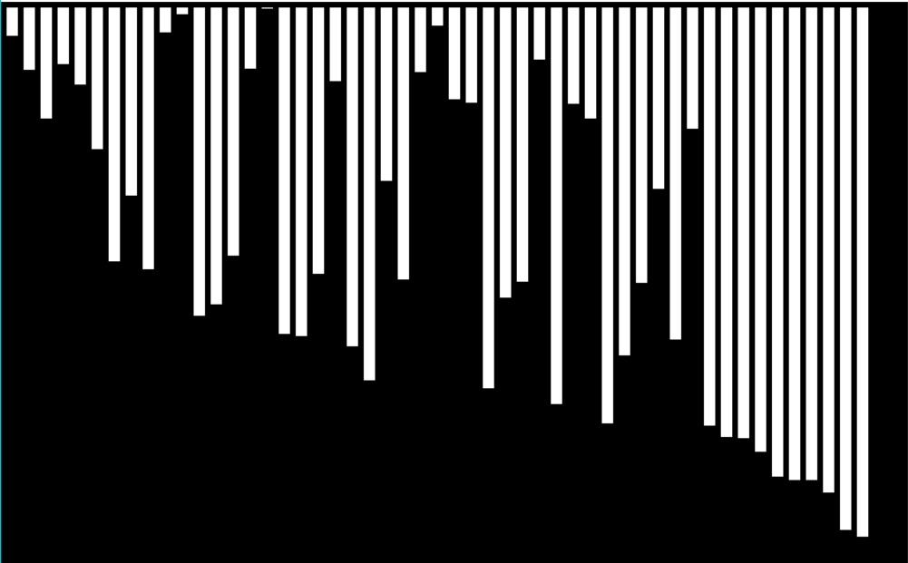

# Sorting Algorithm visualizer
I have visualised the following sorting algorithms using Pygame.

# Sorting techniques used here
- Bubble Sort
- Selection Sort

# How it looks

# Requiremets
- Pygame (pip install pygame)

# how to run
- select folder based on the sorting technique you wanna see
- run <b>show.py</b> inside the selected folder
